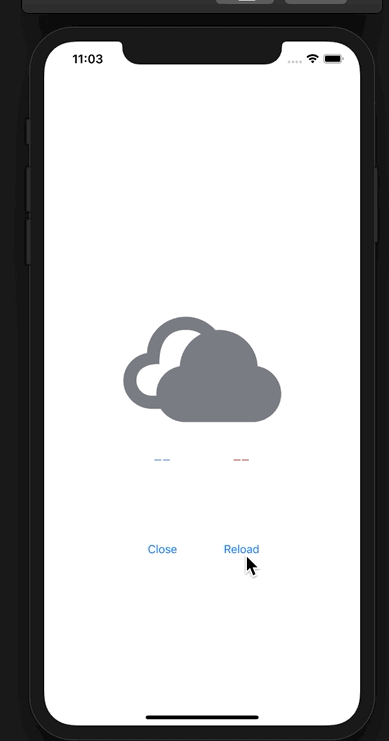

# 天気予報を取得し、表示する
`YumemiWeather`のAPIを使用して、天気予報を取得しましょう。  

Simple ver  
`public static func fetchWeatherCondition() -> String`  
[APIの概要](YumemiWeather.md)

## 課題
- ボタンをタップして天気予報を取得する
- 天気予報を画面に表示する

画像はこれを利用してください
- [sunny](Images/iconmonstr-weather-1.pdf)
- [cloudy](Images/iconmonstr-weather-11.pdf)
- [rainy](Images/iconmonstr-umbrella-1.pdf)

※イメージ  

## 附録
[関連ワード・動画索引（熊谷さんのやさしい Swift 勉強会）](https://yumemi.notion.site/2ed5f2dd1a264593b50994e74b3be4bc)
