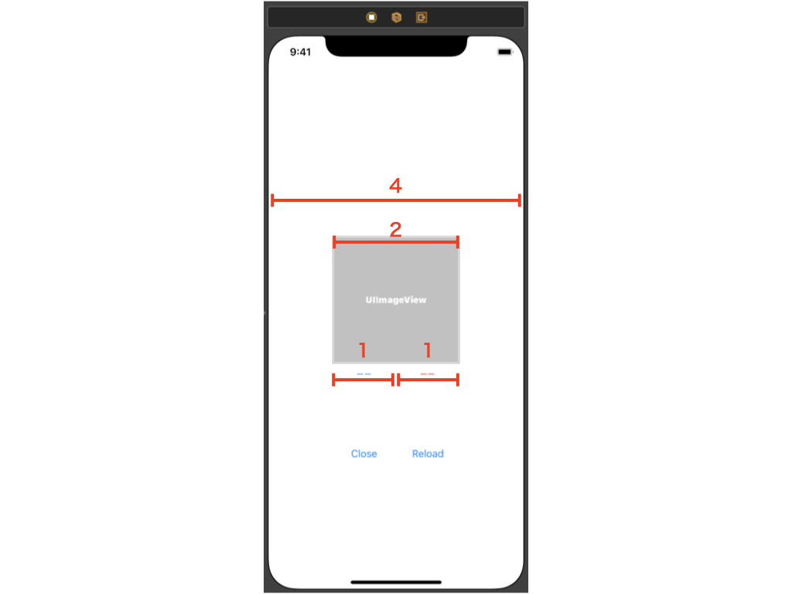
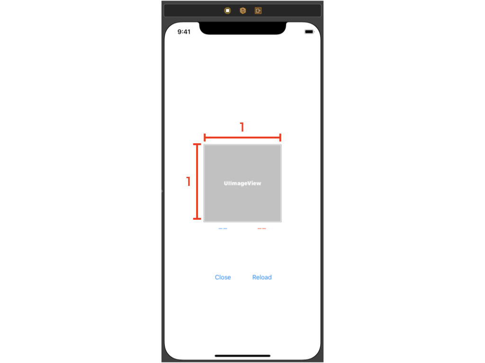
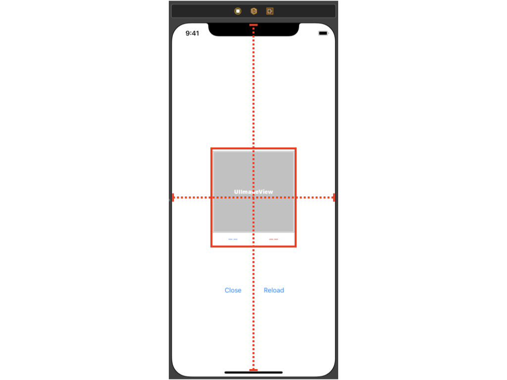
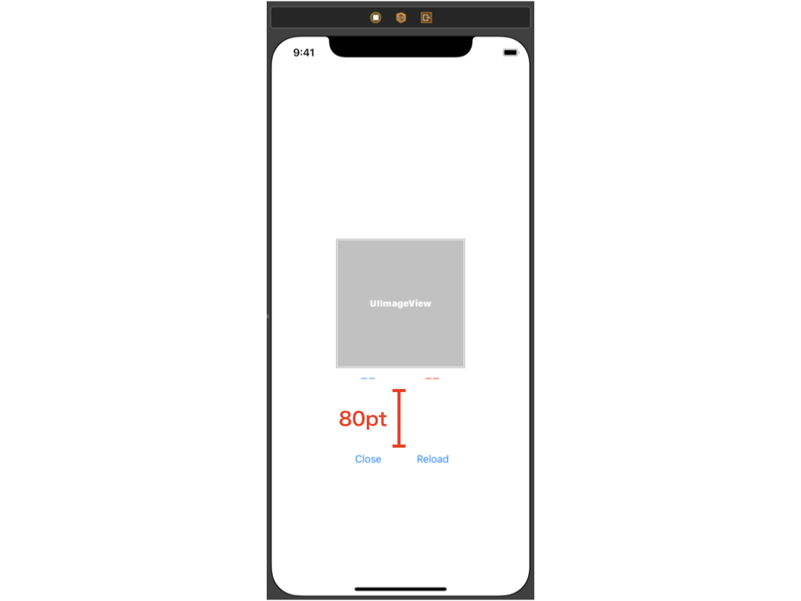

# AutoLayout

Viewのレイアウトを決定する仕組みのひとつにAuto Layoutがあります。  
制約(`NSLayoutConstraint`)を組み合わせてViewのレイアウトを解決します。  
制約とは例えば`このViewの上辺は親のViewの上辺からXポイントあける`、`このViewとこのViewの幅は同じにする`
のようなものです。

執筆から時間が経過していますが、概要を掴むには良い記事  
[Hatena-Textbook](https://github.com/hatena/Hatena-Textbook/blob/master/swift-development-apps.md#auto-layout)

AppleのDocument  
[NSLayoutConstraint](https://developer.apple.com/documentation/uikit/nslayoutconstraint)  
[Auto Layout Guide](https://developer.apple.com/library/archive/documentation/UserExperience/Conceptual/AutolayoutPG/)

InterfaceBuilderで制約を与える方法、NSLayoutConstraintオブジェクトを使用してコードで制約を与える方法のほか、サードパーティのライブラリでコードから直感的に制約を与えられるものもあります。  
[SnapKit](https://github.com/SnapKit/SnapKit)  
[Cartography](https://github.com/robb/Cartography)

# 天気予報アプリの画面レイアウトを構成する
## 課題
以下の条件の画面レイアウトを作ってみましょう
- UIImageViewの幅はUIViewControllerの幅の半分
- 青字のUILabelと赤字のUILabelの幅はUIImageViewの半分

- UIImageViewの高さと幅は同じ
- UIImageViewとUILabelの隙間はあけない

- UIImageViewの水平中央はUIViewControllerの中央と同じ
- UIImageViewとUILabelを合わせた矩形の垂直中央はUIViewControllerの中央と同じ

- UIButtonとUILabelの隙間は80pt

- UIButtonとUILabelの水平中央は同じ

## 附録
[関連ワード・動画索引（熊谷さんのやさしい Swift 勉強会）](https://yumemi.notion.site/407a7e666af74b80ba8692646d99803c)
