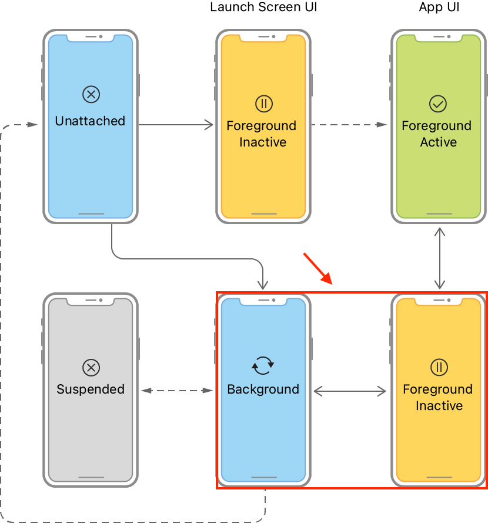

# NotificationCenter

Observerパターンを実現するための仕組みとして、NotificationCenterがあります。  
イベントの発生を、一度に多くに知らせることができます。

Sender(イベント通知者)はObserver(イベント観察者)のことを知る必要がありません。  

[NotificationCenter](https://developer.apple.com/documentation/foundation/notificationcenter)

昨今は、NotificationCenterを使わずともObserverパターンを実現するライブラリ等がありますので、アプリで積極的に使われることは少なくなったように思います。
ただ、プラットフォーム由来のイベント通知を受ける際は今でも用いられることがあります。

例えば、UIApplicationDelegateがNotificationCenterを経由して提供するイベントはいくつもあります。  
※ `NSNotification.Name`を探してみましょう  
- [UIApplicationDelegate](https://developer.apple.com/documentation/uikit/uiapplicationdelegate)
- [UISceneDelegate](https://developer.apple.com/documentation/uikit/uiscenedelegate)

NotificationCenterはSenderとObserverの仲介役として機能します。  
SenderとObserverは互いに知る必要がありません。  
最低限`NSNotification.Name`のみ知っていればイベントを受け取ることができます。  
なので、多用しすぎるとコードが追い辛くなる傾向になるように筆者は感じます。

## KVO
NotificationCenterと同様にObserverパターンを実現する仕組みとして、KVO(Key Value Observing)があります。  
KVOはオブジェクトのプロパティの値を監視することができます。  
KVOも昨今は使われる機会は減ったように思います。参考まで。  
[Using Key-Value Observing in Swift](https://developer.apple.com/documentation/swift/cocoa_design_patterns/using_key-value_observing_in_swift)

# アプリがフォアグラウンドにきたとき天気予報を更新する
## 課題
- NotificationCenterを利用して、アプリがバックグラウンドからフォアグラウンドに戻ってきたときに、天気予報を更新する
- アラートが表示された状態での動きも確認してみましょう

下の図の赤枠の部分の矢印の遷移がバックグラウンドからフォアグラウンドに戻ってきたときになります。

[Managing your app’s life cycle](https://developer.apple.com/documentation/uikit/app_and_environment/managing_your_app_s_life_cycle)

## 附録
[関連ワード・動画索引（熊谷さんのやさしい Swift 勉強会）](https://yumemi.notion.site/710cec1d24904e5da79e3bdaa1273dc1)
