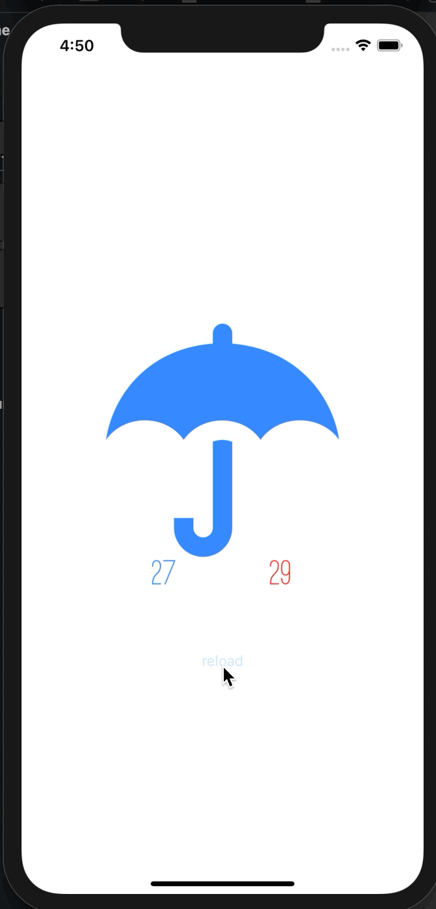

# UIViewControllerのライフサイクル

UIViewControllerのライフサイクルに関するリファレンスをまとめました。よく読んでみてください。  
各コールバック関数に`print`を入れて、動作を確認してみると良いです。

### Viewの生成、表示、非表示
[Work with View Controllers](https://developer.apple.com/library/archive/referencelibrary/GettingStarted/DevelopiOSAppsSwift/WorkWithViewControllers.html#//apple_ref/doc/uid/TP40015214-CH6-SW1)  
※`Understand the View Controller Lifecycle`の項  

### レイアウト調整
[viewWillLayoutSubviews](https://developer.apple.com/documentation/uikit/uiviewcontroller/1621437-viewwilllayoutsubviews)  
[viewDidLayoutSubviews](https://developer.apple.com/documentation/uikit/uiviewcontroller/1621398-viewdidlayoutsubviews)

# 別画面に遷移して、戻ってきたとき天気予報を更新する
## 課題
- ボタンをタップして新しいViewControllerに遷移する
- 新しいViewControllerには`閉じるボタン`を追加する
- 新しいViewControllerを閉じると天気予報を更新する

※イメージ  
