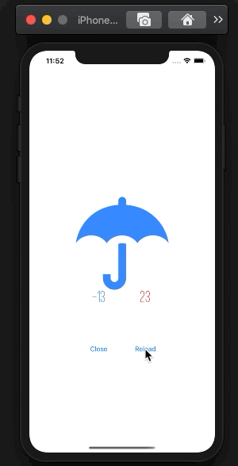

# スレッドブロック

時間のかかる処理を扱ってみましょう。

Sync ver  
```swift
static func syncFetchWeather(_ jsonString: String) throws -> String
```
[APIの概要](YumemiWeather.md)  

## 課題
- 呼び出しAPIを`Sync ver`に変更する
- APIの処理が戻るまでUIActivityIndicatorを表示する

※イメージ  
